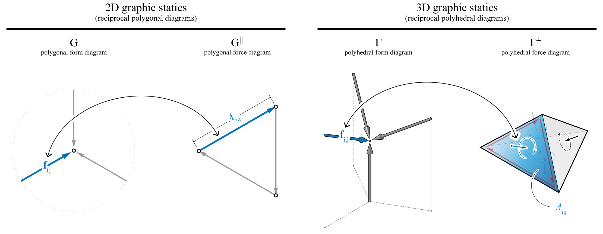
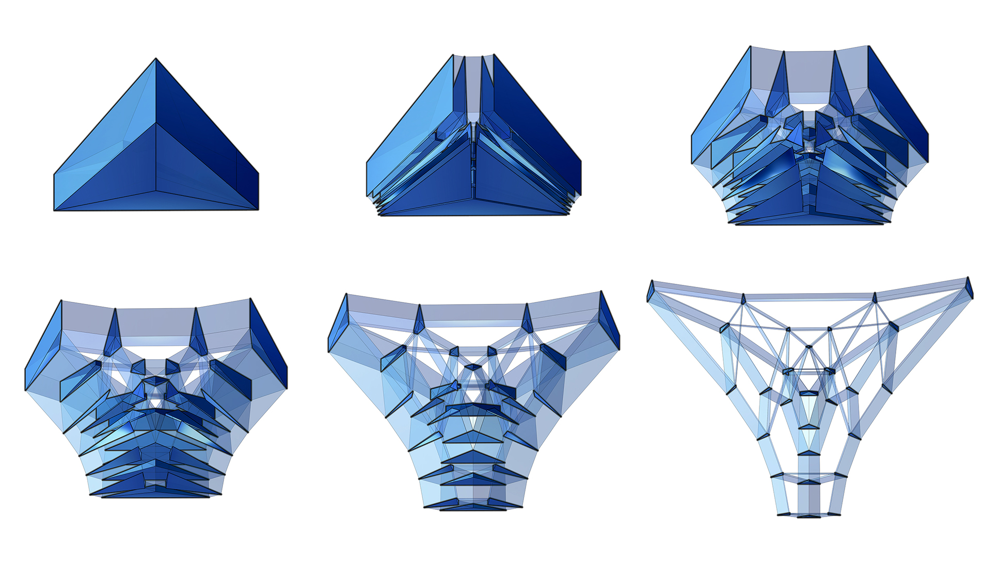

********************************************************************************
Graphic Statics
********************************************************************************

Graphic statics
===============

Graphic statics is widely known as a design and analysis method for two-dimensional (2D) discrete structures, that relies on geometrical rather than analytical or numerical representations of the relation between a structure's geometry and the equilibrium of its internal forces ([1]_, [2]_, [3]_).
Graphical representation of equilibrium using reciprocal form and force diagrams provides invaluable insight for designers and improves intuitive understanding of a structure's behaviour through a visual medium that is easier to understand and more transparent than conventional, arithmetic or numerical methods ([4]_).

|

.. figure:: ../_images/cremona_gs.jpg
    :width: 100%

    Pages from Cremona's *Le figure reciproche nella statica grafica* ([4]_).

Graphic statics gradually disappeared from structural engineering practice over the 20th century due to the advancement of computers and powerful numerical software.
However, there has been a recent revival of graphic statics through computational implementations, which have enabled dynamic interaction between form and force diagrams with real-time, visual feedback.
These interactive implementations of graphic statics allow users to directly control the geometry of forces, which enable force-driven design approaches with high formal freedom to create structurally informed geometries during early stages of design.

|

.. figure:: ../_images/compas_3gs_interactive_gs.gif
    :width: 100%

    An interactive graphic statics drawing of a constant-force truss using `GeoGebra <https://www.geogebra.org>`_ (available on `eQuilibrium <http://block.arch.ethz.ch/eq/>`_, an online graphic-statics-based teaching platform developed by the `Block Research Group <http://block.arch.ethz.ch/brg/>`_).

----

3D graphic statics
==================

In 2D graphic statics, the geometry of a structure and the static equilibrium of its internal forces are represented by a reciprocal form and force diagrams.
Reciprocal form and force diagrams consist of an equal number of lines, such that the corresponding lines in the two diagrams are parallel (or perpendicular, or at any constant angle), and the corresponding lines which converge to a point in one diagram form a closed polygon in the other.
The length of an edge in the force diagram represents the magnitude of internal axial force in the corresponding edge in the form diagram.

More recently, graphic statics has been extended into the third dimension (3D) ([5]_, [6]_) where the equilibrium of external forces or a node of a structure is represented by a closed polyhedron or a polyhedral cell.
The edge of a polyhedral form diagram is perpendicular in orientation relative to the corresponding face in the polyhedral force diagram.
For each polyhedral cell, the normal and the area of a face represent the direction and magnitude of the internal axial force in the corresponding member of the polyhedral form diagram, respectively.

|

    Reciprocal polygonal diagrams of 2D graphic statics (left), and reciprocal polyhedral diagrams of 3D graphic statics (right).

One of the the most unique properties of computational graphic statics is that the form of the structure can be modified or controlled through the geometry of the force diagrams.
Whereas most conventional structural design or analysis software are dependent on predefined forms, computational graphic statics provides drastically different ways of approaching structural design problems by using the geometry of the force diagrams as the catalyst for design, analysis and optimisation.
Exploration of structural forms by constraining, optimising, manipulating and designing the geometry of the force diagrams has the potential to significantly broaden the design space.
Computational implementations of graphic statics ([7]_) through interactive platforms enable uninhibited exploration of these new force-driven design spaces, and discovery of unforeseen structural possibilities freed from any institutionalised biases or prejudices.

|

    :ref:`Unified diagram <02_6_unified_diagram>` of a compression-only, spatially branching structure.

----

References
==========

.. [1] Maxwell J.C. (1864). *On reciprocal figures and diagrams of forces*. Philosophical Magazine Series 4 27 (182), pp. 250-261.

.. [2] Culmann K. (1864). *Die Graphische Statik*. Zurich: Verlag Meyer und Zeller.

.. [3] Cremona L. (1872). *Le figure reciproche nella statica grafica*. Milano: Tipografia di G. Bernardoni.

.. [4] Allen E. and Zalewski W. (2009). *Form and Forces: Designing Efficient and Expressive Structures.* New York: Wiley.

.. [5] Rankine W. (1864). Principle of the equilibrium of polyhedral frames. *Philosophical Magazine Series 4 27 (180)*, 92.

.. [6] Akbarzadeh M., Van Mele T. and Block P. On the equilibrium of funicular polyhedral frames and convex polyhedral force diagrams. *Computer-Aided Design 63*, 118–128.

.. [7] Lee J. (2018). *Computational Design Framework for 3D Graphic Statics*. PhD thesis, ETH Zurich, Zurich, Switzerland.