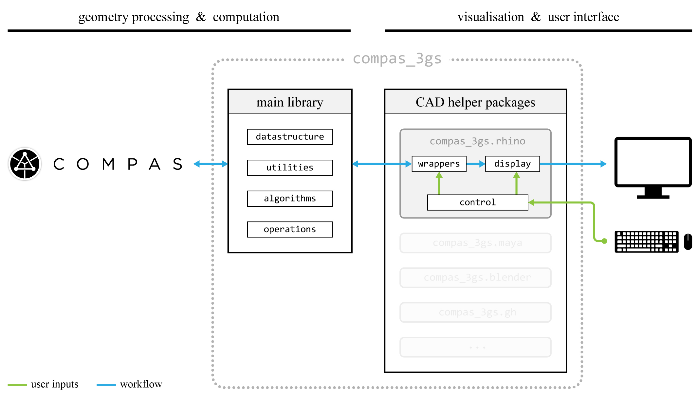

********************************************************************************
Implementation
********************************************************************************

``compas_3gs`` is implemented independent of the functionality provided by existing CAD software.
However, CAD tools are still necessary for constructing and manipulating geometry, applying constraints interactively, making custom user interfaces and visualising script results.
While the geometric computation is handled by ``compas_3gs`` in the background, existing CAD software can be used as the medium for processing, visualising and interacting with datastructures and geometrical objects.

For the examples presented in this documentation, `Rhinoceros <https://www.rhino3d.com/>`_ is chosen as the CAD software for user interaction and visualisation of script results, mainly due to its wide usage in architecture, an established user base and a large ecosystem of additional plugins and packages.
The built-in visualisation and control functions of Rhinoceros are exploited to create an interactive environment that is specifically calibrated for 3D graphic
statics design applications.
Helper packages for other CAD software can be developed in the future.

|

