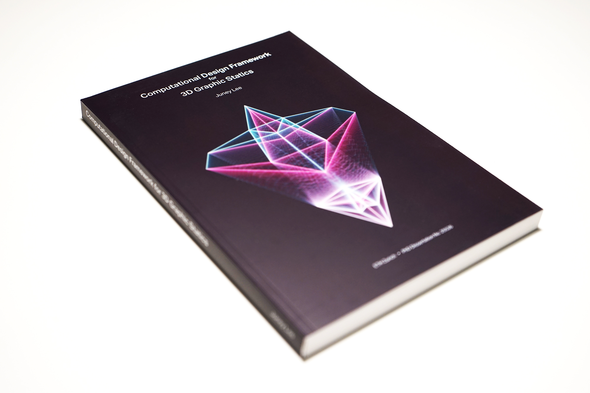

********************************************************************************
compas_3gs
********************************************************************************

The theoretical foundation and the computational development of the main library of the :mod:`compas_3gs` are based on these following publications.

|

----

Computational Design Framework for 3D Graphic Statics
=====================================================

*by* Juney Lee

|

**Abstract**

This dissertation presents a computational framework for structural design applications based on 3D graphic statics using polyhedral force diagrams.
At the core of this framework is the development of a generalised theoretical foundation for 3D graphic statics, underpinned by the formulation of three datastructures for addressing a wide range of equilibrium problems involving spatial systems of forces: a polyhedral cell, the multi-cell polyhedron, and generalised cell networks.
The three datastructures along with the relevant operations and geometric algorithms are implemented in an open-source library with interactive user interfaces to common computational design environments targeting both architects and structural engineers.
The framework is developed with the goal of maximising the inherent benefits of computational graphic statics, which diminish with increasing complexity of spatial structures: legible visualisation of force equilibrium, intuitive designer interactivity in real time, and provision of new structural design insights.
In contrast to conventional numerical approaches to structural design that are dependent on predefined formsbefore any analysis can be executed, the presented framework enables new design methodologies that explore the geometry of forces as the catalyst for design, analysis, and optimisation of spatial structures.
These new potentials are illustrated through numerous examples, showcasing how the framework could be used to address structural design problems in a variety of new ways that are simply not possible with existing, form-dependent tools.
Beyond equilibrium design and analysis,the practical relevance of this research in architectural fabrication and construction is demonstrated through the MycoTree project, a 1-to-1 built prototype of a spatially branching structure made of load-bearing mycelium components.

**Contributions**

* State of the art on computational graphic statics
* Theoretical background of the computational framework for 3D graphic statics
* Detailed formulations and descriptions of the three datastructures: polyhedral cell (mesh), multi-cell polyhedron (volmesh) and cell networks (network of meshes)
* Design results and applications using the framework

Available via `ETH Zurich Research Collection <https://www.research-collection.ethz.ch/handle/20.500.11850/331210>`_.

.. code-block:: latex

    @phdthesis{Lee_2018_phd,
        author      = "Juney Lee",
        title       = "Computational Design Framework for 3D Graphic Statics",
        institution = "ETH Zurich, Department of Architecture",
        year        = "2018",
        address     = "Zurich",
        month       = "",
        doi         = "10.3929/ethz-b-000331210",
        note        = "",
    }

|

----

Disjointed force polyhedra
==========================

*by* Juney Lee, Tom Van Mele, Philippe Block

|

**Abstract**

This paper presents a new computational framework for 3D graphic statics based on the concept of disjointed force polyhedra.
At the core of this framework are the Extended Gaussian Image and area-pursuit algorithms, which allow more precise control of the face areas of force polyhedra, and consequently of the magnitudes and distributions of the forces within the structure.
The explicit control of the polyhedral face areas enables designers to implement more quantitative, force-driven constraints and it expands the range of 3D graphic statics applications beyond just shape explorations.
The significance and potential of this new computational approach to 3D graphic statics is demonstrated through numerous examples, which illustrate how the disjointed force polyhedra enable force-driven design explorations of new structural typologies that were simply not realisable with previous implementations of 3D graphic statics.

**Contributions**

* Iterative method for constructing polyhedral cells from equilibrated force vectors using the Extended Gaussian Image
* Theoretical background for disjointed network of polyhedral cells

Available via `ScienceDirect <https://www.sciencedirect.com/science/article/pii/S0010448518300654?via%3Dihub>`_.

.. code-block:: latex

    @article{Lee_2018_dfp,
        author  = "Lee, J. and Van Mele, T. and Block, P.",
        title   = "Disjointed Force Polyhedra",
        journal = "Computer-Aided Design",
        year    = "2018",
        volume  = "99",
        number  = "",
        pages   = "11-28",
        month   = "June",
        doi     = "10.1016/j.cad.2018.02.004",
        note    = "",
    }
