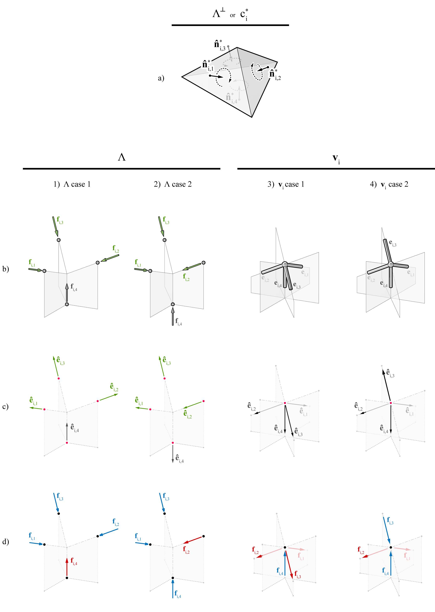

********************************************************************************
Interpreting diagrams
********************************************************************************

A force **f**:sub:`i,j` acting on node vi can be either a compression force or a tension force; it is a compression force if it is pushing onto the node, or a tension force if it is pulling away from the node.
In 3D graphic statics, the direction of **f**:sub:`i,j` is the same as the direction of the normal **n̂** :sup:`*`:sub:`i,j` of the corresponding face of the polyhedral cell.
Therefore, a single force polyhedron can represent the equilibrium of various combinations of compression and tension forces ([1]_).
For example in b1 and b2 in the figure below, the directions of the external forces are in the same orientations and directions as the corresponding face normals in `c`:sup:`*`:sub:`i` (a in figure below).
However, the external forces are interpreted differently; **f**:sub:`i,4` of :math:`\Lambda` case 1 is in tension, while **f**:sub:`i,4` of :math:`\Lambda` case 2 is in compression.

The interpretation the *j*-th external force or the internal force of the *j*-th
structural member at node **v**:sub:`i` as either compression or tension, can be made by comparing the face normal **n̂** :sup:`*`:sub:`i,j` and the orientation of the corresponding member ([2]_).
Locally defined for each node **v**:sub:`i`, the orientation of the *j*-th external force or member can be represented by a unitised edge vector **`ê`**:sub:`i,j` with the tail of the vector at **v**:sub:`i` (c in figure below).
If **n̂** :sup:`*`:sub:`i,j` and **ê**:sub:`i,j` are pointing in the same direction, the force in the corresponding member is interpreted as positive, so in tension; if the vectors are in opposite directions, the force in the corresponding member is interpreted as negative, so in compression.
The compression and tension forces are shown in blue and red, respectively.

|

    Multiple configurations of compression and tension elements are possible for a polyhedral cell: a) :math:`\Lambda^{\perp}` or polyhedral cell `c`:sup:`*`:sub:`i` of node **v**:sub:`i`; b) orientation of the members or external forces as unitised vectors **ê**:sub:`i,j`; and c) the direction and type of forces in the members.

|

----

References
==========

.. [1] Akbarzadeh, M. (2016). *3D Graphical Statics using 3D Reciprocal Diagrams*. Ph.D. thesis, ETH Zürich, Zürich, Switzerland.

.. [2] Lee, J., T. Van Mele, and P. Block (2016). Form-finding explorations through geometric transformations and modifications of force polyhedrons. In *Proceedings of the 2016 International Association for Shell and Spatial Structures (IASS) Symposium*, Tokyo, Japan.