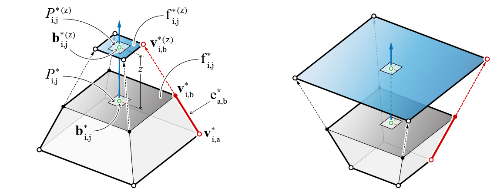
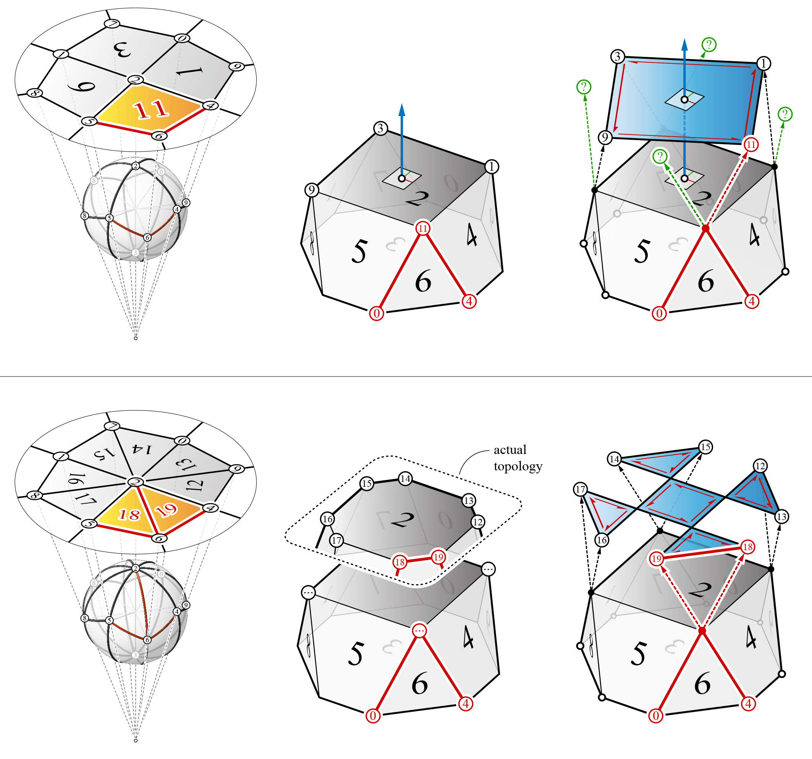
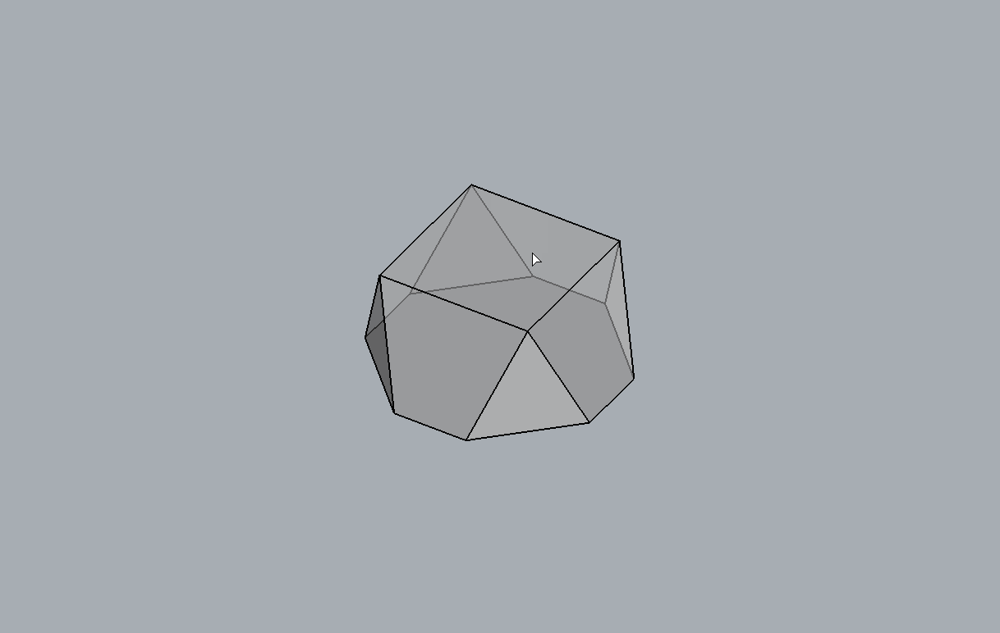

********************************************************************************
Constrained manipulation
********************************************************************************

In most computational graphic statics applications in 2D or 2.5D, geometric
manipulations of form and force diagrams are simple and straightforward
using a mouse and a computer monitor.
Because the diagrams are coplanar on a single viewing plane, one can simply click and move the vertices of the force diagram to observe the consequential effects on the form diagram in real-time. Moving the vertices of a 2D force diagram changes both the magnitudes and orientations of the corresponding external forces or members in the form diagram.

Geometric manipulations of polyhedral cells are not as straightforward or intuitive without the fixed viewing plane of 2D applications or the projection plane of 2.5D applications.
Moving the vertices of a polyhedral cell changes its geometry, but it is not immediately clear to the user how much effect the geometric transformation has on the new distribution or orientations of forces.
Vertex translation in 3D space also requires meaningful geometric guides or constraints that are based on the local geometry of the polyhedral cell to avoid arbitrary or counterproductive transformations.
Furthermore, the translation of vertices could also cause some of the faces of the polyhedral cell to become non-planar.
For manipulating the geometry of polyhedral cells while enforcing the planarity constraints of the faces, vertex translations are simply not sufficient enough.

In order to change the force distribution of a polyhedral cell while
maintaining the initial face orientations, a face can be pulled along its normal
vector.

|

If a face contains vertices that have valencies or degrees of four or more (more than one trailing edge), the pulling or tilting of the axis will result in faces that are no longer in their original orientations or possibly non-planar.
The topological transformation of a cell can be guided and significantly simplified by the EGI.
The corresponding EGI face of a high-valent cell vertex can be split, which creates an extra vertex.
Using the new topology of the EGI, the new faces of the cell can be constructed before the face pull operation is performed.

|

----

Example
=======

|

.. raw:: html

    

    

    
Download

* :download:`cells.3dm <../../../examples/rhino_files/cells.3dm>`

.. raw:: html

    

    

.. literalinclude:: ../../../examples/00_10_cell_pull_face.py
    :language: python

