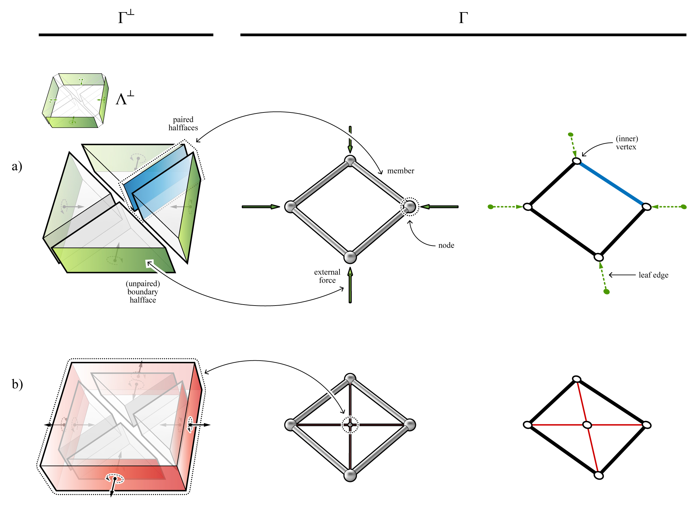

********************************************************************************
Interpreting diagrams
********************************************************************************

Direction of forces
===================

Based on the same convention used for interpreting the forces of a single polyhedral cell, the two nodes that define a member in tension will correspond to two cells with positive cell directions in :math:`\Gamma^{\perp}` (Figure 1-a); two nodes that define a member in compression will correspond to two cells with negative cell directions (Figure 1-b).
:math:`\Gamma^{\perp}` for compression-only funicular structures will only
consist of cells with negative directions, whereas tension-only funicular
structures will only consist of cells with positive directions.
For a structure that contains members in both compression and tension, :math:`\Gamma^{\perp}` contains both positive and negative cells.
It is possible for a polyhedral cell to have no cell direction.
For example, a complex polyhedral cell where all of its faces are complex and have oriented areas of zero (and therefore no oriented normals), would have no
cell direction.
Therefore, if either of the pair of adjacent cells have no cell direction, the corresponding member in :math:`\Gamma` would be a zero-force member.

.. figure:: ../../_images/volmesh_interpretation.jpg
    :width: 100%

    **Figure 1.** Interpretation of member forces in relation to the cell directions of the corresponding pair of adjacent cells: a) two adjacent cells with positive cell directions, which corresponds to a member in tension; b) two adjacent cells with negative cell directions, which corresponds to a member compression; c) and d) two adjacent cells that have different cell directions may correspond to a member in either compression or tension.

----

Computational interpretation
============================

In a ``network`` or ``volmesh`` representation of a polyhedral form diagram, the directed edges can also be used for the interpretation of forces.
In 2D and 2.5D applications of computational graphic statics, a directed
edge of the form diagram `e`:sub:`i→j` and the corresponding directed edge `e`:sup:`*`:sub:`i→j` in the force diagram are parallel and have the same orientations for tensile forces or members ([1]_).
If they are parallel but have opposite orientations, `e`:sub:`i→j` is in compression.
In 3D graphic statics, the same interpretation can be made by comparing the orientations of the directed edges in the form diagram and the normals of the corresponding ''directed faces” ([2]_)  .

For a ``mesh`` representing a polyhedral cell, the directed face is simply the
face of the mesh that corresponds to its dual edge.
However, a ``volmesh`` representing a multi-cell polyhedron does not have face information in its datastructure.
For a ``volmesh``, a directed face that corresponds to `e`:sub:`i→j` is equivalent to the halfface of the *i*-th cell of :math:`\Gamma^{\perp}`, whose paired halfface belongs to the *j*-th cell.
In the example shown in Figure 2, the directed face of directed edge `e`:sub:`0→2` is the halfface of `c`:sup:`*`:sub:`0`, whose paired halfface belongs to `c`:sup:`*`:sub:`2` (highlighted in blue).
For `e`:sub:`1→6`, the directed face is simply the halfface of `c`:sup:`*`:sub:`1` that corresponds to that edge (highlighted in green).
Figure 2-c, d, and e are three different configurations of :math:`\Gamma` where each directed edge maintains the same connectivity and perpendicularity with the corresponding directed faces, but have different force distributions.

|

.. figure:: ../../_images/volmesh_computational_interpretation.jpg
    :width: 100%

    **Figure 2.** Interpretation of the forces using the directed edges of the ``network`` and the corresponding directed faces of the ``mesh`` or ``volmesh``: a) a multi-cell polyhedron :math:`\Gamma^{\perp}` with four prismatic cells; b) the “directed faces” of :math:`\Gamma^{\perp}`; c), d) and e) various configurations of the form diagram :math:`\Gamma`, where perpendicularity is enforced but the force distributions are different.

----

Diagram hierarchy
=================

For externally loaded structures, the cells of a :math:`\Gamma^{\perp}` can be categorised into two groups: the global force polyhedron :math:`\Lambda^{\perp}` representing the equilibrium of the external forces; and nodal polyhedral cells `c`:sup:`*`:sub:`i` that each represent the local equilibrium at node **v**:sub:`i` . While each cell `c`:sup:`*`:sub:`i` corresponds to a node, a pair
of conjoined cells represent a member in :math:`\Gamma` (Figure 3-a).
At the interface of two conjoined cells is a pair of halffaces.
The boundary halffaces at the extremities of a :math:`\Gamma^{\perp}` are not paired, and therefore represent external forces.
The combination of all of the boundary halffaces represents the global force
polyhedron, :math:`\Lambda^{\perp}`.

Self-stressed structures have no external forces.
Therefore, the corresponding :math:`\Gamma^{\perp}` does not have any unpaired, boundary halffaces.
The example shown in (Figure 3-b) has four triangular prismatic cells which are all contained within a single outer rectangular cell.
In contrast to the example in Figure 2-a, the four external forces represented by the four boundary halffaces, is now internally resolved at a single central node whose equilibrium is represented by the outer rectangular cell.

    **Figure 2.** A force diagram :math:`\Gamma^{\perp}` with prismatic polyhedral cells and the corresponding 2D form diagram :math:`\Gamma` (vertical forces not shown): a) a structure with four external forces; and b) a self-stressed structure with five cells and no external forces.

----

References
==========

.. [1] Van Mele, T. and P. Block (2014). Algebraic graph statics. *Computer-Aided Design* 53, 104–116.

.. [2] Lee J. (2018). *Computational Design Framework for 3D Graphic Statics*. PhD thesis, ETH Zurich, Zurich, Switzerland.
