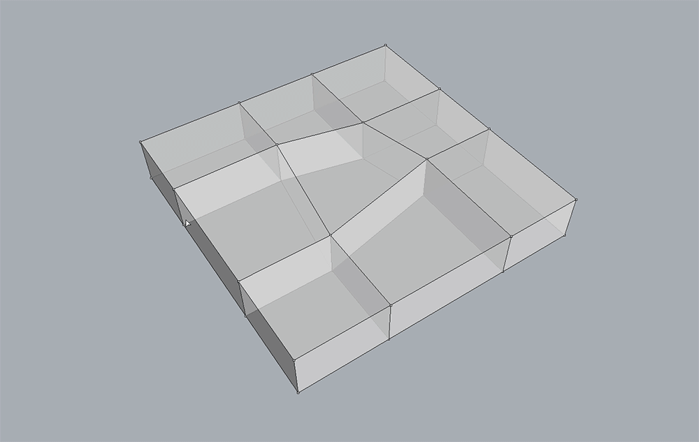

********************************************************************************
Arearisation
********************************************************************************

Arearisation of a ``volmesh`` is implemented as a special case of the planarisation algorithm.
In addition to the planarisation of the faces by projection at each iteration step, they can be re-sized to match target areas.

|

----

Example
=======

In this example, four randomly chosen faces are given new target areas.
The initial normals of all of the faces are constrained to remain unchanged.

|

.. raw:: html

    

    

    
Downloads

* :download:`volmesh_mat.3dm <../../../examples/rhino_files/volmesh_mat.3dm>`

.. raw:: html

    

    

.. literalinclude:: ../../../examples/01_50_volmesh_arearisation.py
    :language: python