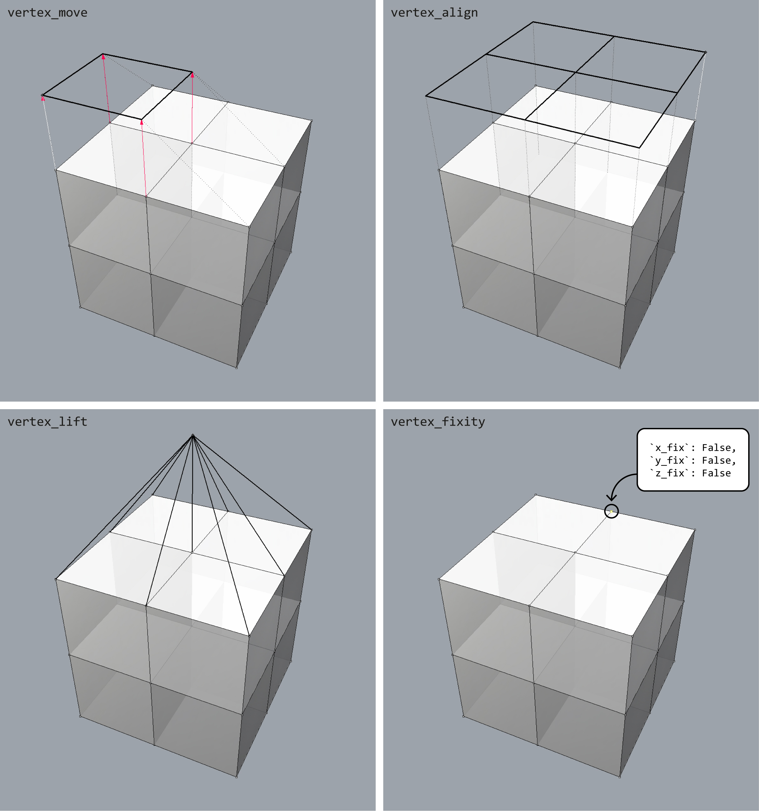

********************************************************************************
Modification
********************************************************************************

Modifying the geometry of the ``volmesh`` representation of a polyhedral force diagram enables exploration of a wide range of spatial structures while maintaining the static equilibrium.
Moving the vertices of a ``volmesh`` changes the distribution of forces in the structure, whereas adding or subdividing cells of a ``volmesh`` introduces new members and nodes to the structure.

|

----

Example
=======

This example shows a few vertex operations that modify the geometry or the attributes of a ``volmesh``.

|

.. raw:: html

    

    

    
Downloads

* :download:`volmesh_cubes_4x4.3dm <../../../examples/rhino_files/volmesh_cubes_4x4.3dm>`

.. raw:: html

    

    

.. literalinclude:: ../../../examples/01_60_volmesh_modification.py
    :language: python