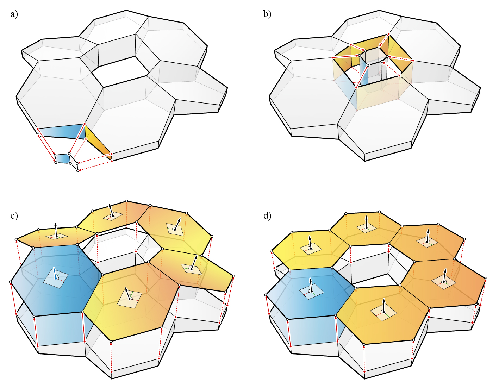
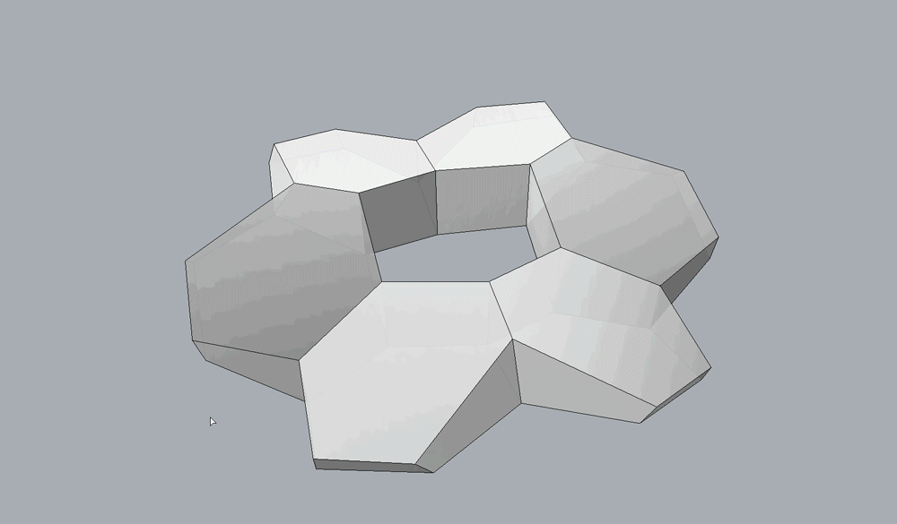

********************************************************************************
Transformation
********************************************************************************

In some design scenarios, it may be convenient to manipulate several faces at once.
Unlike the face pull operation of a single polyhedral cell, pulling a face of a ``volmesh`` has a cascading geometric effect on a series of faces.
Constrained geometric manipulations of a ``volmesh`` while maintaining the initial face orientations can be conceptualised as a face relocation problem, where the localised face pull operations are applied at the cell level.

The first step for applying a constrained face operation to an arbitrary
face `f`:sup:`*`:sub:`i,j` (shown in blue, Figure 1) of a ``volmesh`` is to identify the dependent faces (shown in gold, Figure 1).
The dependent faces are other neighbouring faces of `f`:sup:`*`:sub:`i,j` that will also need to be transformed as a by-product of the face pull operation on face `f`:sup:`*`:sub:`i,j`.
A dependent face is a face of the neighbouring cells which share an edge with the initial face `f`:sup:`*`:sub:`i,j`, or other dependent faces.
There can be only one dependent face per cell.
The dependent face finding procedure is repeated until there are no more faces left in the ``volmesh`` that meets this requirement.

Once all of the dependent faces have been identified, the transformation
operation is a linear process.
The initial face `f`:sup:`*`:sub:`i,j` can be locally pulled or tilted,
following the face pull procedure of a single polyhedral cell.
With the new location of `f`:sup:`*`:sub:`i,j`, the new positions of its dependent faces can be determined one after another.

For each dependent face, the new location is one of the vertices of the edge that is shared with `f`:sup:`*`:sub:`i,j`.
The new dependent face locations can be used to update the geometry of the corresponding cells.
The transformation continues until all of the cells with dependent faces have been updated.
Instead of using the initial normals of `f`:sup:`*`:sub:`i,j` and its dependent faces for the recursive face pull operations, a target normal can be used.
This effectively projects `f`:sup:`*`:sub:`i,j` and its dependent faces to a target plane, which could be a useful in constraining multiple faces at once (Figure 1-d).
This transformation can be applied to the ``volmesh``s as well as their corresponding polyhedral form diagrams.

The resulting geometry of ``volmesh`` instances is not unique, and is
subject to various global constraints enforced by the user.
For example, tilting faces of a ``volmesh`` cannot be executed unless generalised rules or assumptions are provided, such as how much the dependent faces are allowed to change relatively to one another.
Furthermore, pulling of interior faces can have multiple solutions, depending on which faces are allowed to move and which are not.
Most importantly, a large number of triangular faces, especially in the interior cells of a ``volmesh`` can be extremely constraining for any geometric operation.
Unifying transformations such as aligning all dependent faces to a target plane, especially for boundary faces, can be useful in enforcing geometric constraints to multiple cells at once.
However, geometric manipulations of ``volmesh`` instances in general, are highly constrained problems that are directly dependent on the the initial topology.

    **Figure 1.** a), b) , c) Constrained transformations of ``volmesh`` instance through recursive face pull operations (selected face for transformation shown in blue, and their dependent faces shown in gold); and d) face pull operations of the selected face and its dependent faces with a target plane.

----

Example
=======

This example shows how the boundary faces of a ``volmesh`` can be pulled in a constrained manner.

|

.. raw:: html

    

    

    
Downloads

* :download:`volmesh_donut.3dm <../../../examples/rhino_files/volmesh_donut.3dm>`

.. raw:: html

    

    

.. literalinclude:: ../../../examples/01_61_volmesh_transformation.py
    :language: python

