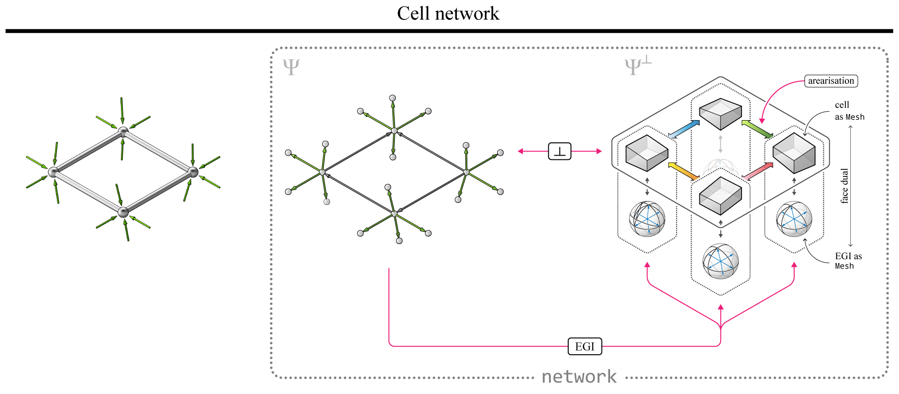
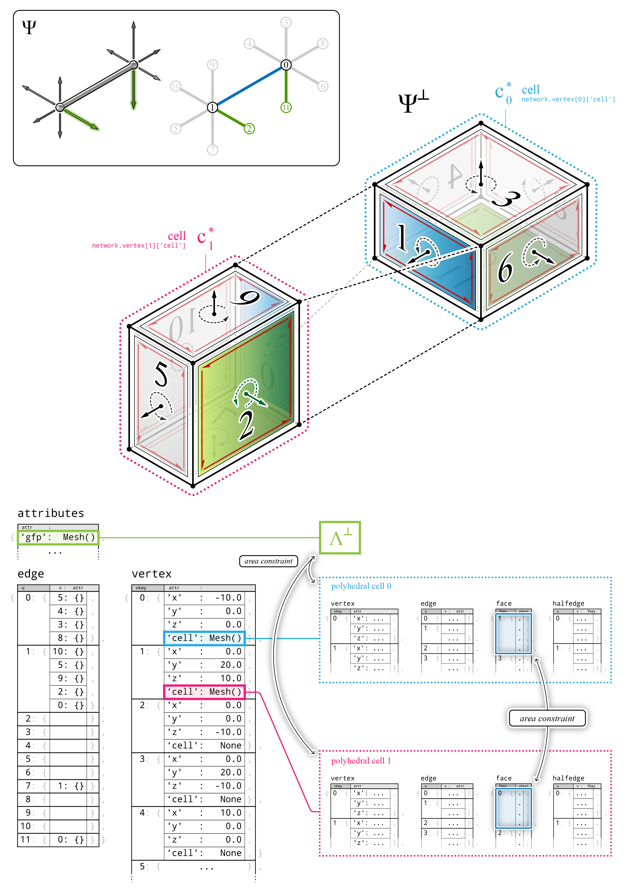

********************************************************************************
Datastructure
********************************************************************************

A cell network :math:`\Phi^{\perp}`, which contains the form diagram and a nodal polyhedral cell at each node, is modelled as a ``network``.
Because :math:`\Phi` and :math:`\Phi^{\perp}` are intrinsically linked and are inter-dependent, a few algorithms need to enforce the necessary global constraints.
The EGI of each node ensures that the topology and geometry of the individual cells are correct and up to date.
The arearisation algorithm ensures that all pairs of adjacent cells have contact faces with equal areas.
Finally, the reciprocation algorithm, enforces perpendicularity between :math:`\Phi` and :math:`\Phi^{\perp}`.

|

----

|

