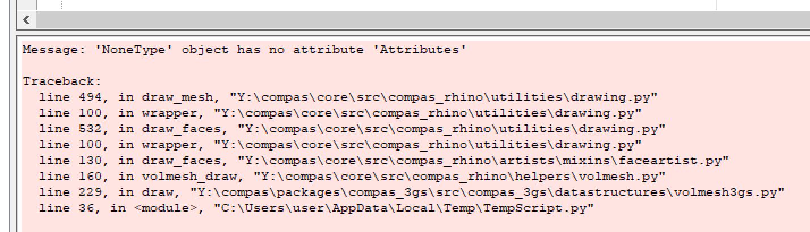

********************************************************************************
Getting started
********************************************************************************

.. _Anaconda: https://www.continuum.io/
.. _EPD: https://www.enthought.com/products/epd/

.. highlight:: bash

Installation
============

Released versions of :mod:`compas_3gs` can be installed with *pip*.
With the desired virtual environment activated, do

::

    $ pip install compas-3gs

You can also install directly from the GitHub repo.

::

    $ pip install git+https://github.com/compas-dev/compas_3gs.git

Updates
=======

If you already have :mod:`compas_3gs` installed and you want to upgrade it to the latest version, do

::

    $ pip install compas-3gs --upgrade

----

Rhino
=====

:mod:`compas_3gs` is developed independent of the functionality of CAD software.
However, CAD software is still necessary in a computational design environment for visualising and interacting with datastructures and geometrical objects.
For the examples presented in this documentation, `Rhinoceros <https://www.rhino3d.com/>`_ is chosen as the CAD software for user interaction and visualisation of script results.
For a more detailed information on how to install COMPAS and its packages for Rhino, please refer to `Working in Rhino <https://compas-dev.github.io/main/renvironments/rhino.html>`_ page of the COMPAS documentation.

In order to install :mod:`compas_3gs` for Rhino, first activate the desired virtual environment, then do

::

    $ python -p compas_rhino install -p compas_3gs

When running scripts using the Rhino Python Editor, this error is occasionally raised while Rhino tries to execute :mod:`compas` drawing functions, often when a new file is opened:

|

|

If such an error is raised, just reset the Python script engine, and the scripts should run without errors.

----

First Steps
===========

* https://compas-dev.github.io/compas_3gs/theoretical_background.html
* https://compas-dev.github.io/compas_3gs/examples.html
* https://compas-dev.github.io/compas_3gs/api_reference.html
