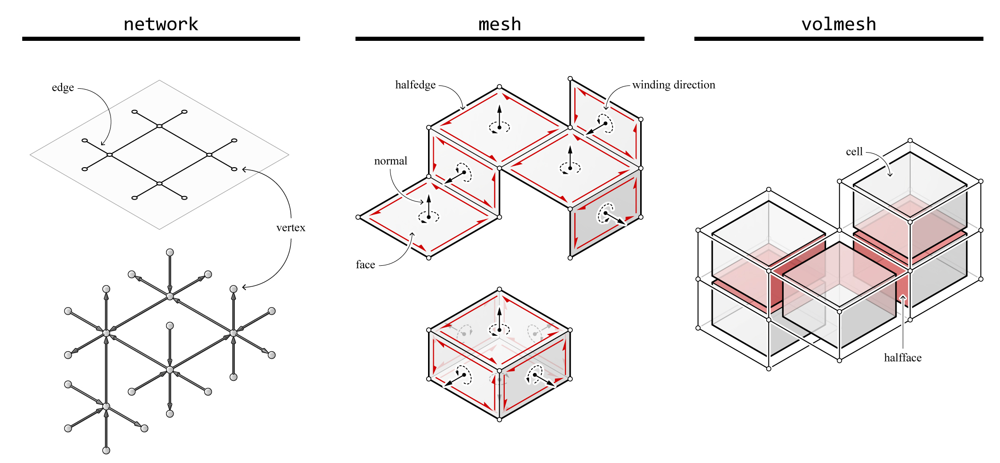

********************************************************************************
Datastructures
********************************************************************************

explain the basic datastructures...

.. image:: ../_images/compas_3gs_datastructure_types.jpg
    :width: 100%

how the compas datastructures are used...

----

Network
=======

A ``network`` is...

----

Mesh
====

A ``mesh`` is...

----

Volmesh
=======

A ``volmesh`` is...

