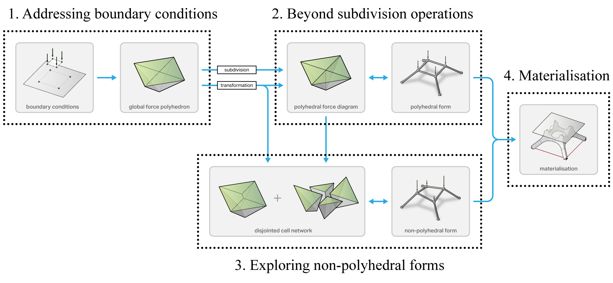

********************************************************************************
Design workflow
********************************************************************************

The conceptual developmenet of ``compas_3gs`` is based on a design workflow that is relevant for practice.

----

1. Addressing boundary conditions
=================================

During the beginning stages of a project, the only information available to the designer may be 1) the support locations and constraints, and 2) load locations and magnitudes.

----

2. Topology generation and exploration
======================================

----

3. Non-polyhedral structures
============================

The reciprocal relationship between the polyhedral form and force diagrams restricts design explorations to structures that are polyhedral in its geometry (i.e. subdivided tree structures, faceted domes, polyhedral mesh or surface structures, crystalline aggregations, etc.).
Inherent geometric constraints of a multi-cell polyhedron makes it impossible to construct force diagrams for spatial structures in equilibrium which may be non-polyhedral in its geometry (i.e. structures with overlapping members, non-planar faces, etc.).
By using cell networks,

----

4. Materialisation
==================
