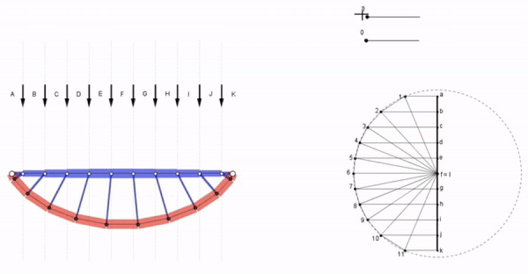

********************************************************************************
3D Graphic Statics
********************************************************************************

Graphic statics
===============

Graphic statics is a design and analysis method for two-dimensional (2D) discrete structures, that relies on geometrical rather than analytical or numerical representations of the relation between a structure's geometry and the equilibrium of its internal forces ([1]_, [2]_, [3]_)
Graphical representation of equilibrium using reciprocal form and force diagrams provides invaluable insight for designers and improves intuitive understanding of a structure's behaviour through a visual medium that is easier to understand and more transparent than conventional, arithmetic or numerical methods ([4]_).

.. figure:: ../_images/cremona_gs.jpg
    :width: 100%
    :align: center

    Pages from Cremona's *Le figure reciproche nella statica grafica* ([4]_).

Graphic statics gradually disappeared from structural engineering practice over the 20th century due to the advancement of computers and powerful numerical software.
However, there has been a recent revival of graphic statics through computational implementations, which have enabled dynamic interaction between form and force diagrams with real-time, visual feedback.
These interactive implementations of graphic statics allow users to directly control the geometry of forces, which enable force-driven design approaches with high formal freedom to create structurally informed geometries during early stages of design.

    An interactive graphic statics drawing of `eQuilibrium <http://block.arch.ethz.ch/eq/>`_, an online teaching platform developed by the `Block Research Group <http://block.arch.ethz.ch/brg/>`_.

3D graphic statics
==================

More recently, graphic statics has been extended into the third dimension (3D) ([6]_, [7]_) where the equilibrium of spatial systems of forces can be represented by closed force polyhedrons ([5]_).
It has also been shown that the reciprocal diagrams used in graphic statics, are planar projections or sections of polyhedral frames and its reciprocal force polyhedrons; 2D graphic statics is a special case of a more general 3D graphic statics.
Therefore, 3D graphic statics not only provides the possibility to model and analyse equilibrium of spatial structures in an interactive manner, but also offers a profoundly new perspective and approach to 2D problems and applications.

One of the the most unique properties of computational graphic statics is that the form of the structure can be modified or controlled through the geometry of the force diagrams.
Whereas most conventional structural design or analysis software are dependent on predefined forms, computational graphic statics provides drastically different ways of approaching structural design problems by using the geometry of the force diagrams as the catalyst for design, analysis and optimisation.
Exploration of structural forms by constraining, optimising, manipulating and designing the geometry of the force diagrams has the potential to significantly broaden the design space.
Computational implementations of graphic statics ([8]_) through interactive platforms enable uninhibited exploration of these new force-driven design spaces, and discovery of unforeseen structural possibilities freed from any institutionalised biases or prejudices.

.. figure:: ../_images/08_mycotree_diagram.jpg
    :width: 100%
    :align: center

    Unified diagram of a spatially branching structure designed using ``compas_3gs``

References
""""""""""

.. [1] Maxwell J.C. (1864). *On reciprocal figures and diagrams of forces*. Philosophical Magazine Series 4 27 (182), pp. 250-261.

.. [2] Culmann K. (1864). *Die Graphische Statik*. Zurich: Verlag Meyer und Zeller.

.. [3] Cremona L. (1872). *Le figure reciproche nella statica grafica*. Milano: Tipografia di G. Bernardoni.

.. [4] Allen E. and Zalewski W. (2009). *Form and Forces: Designing Efficient and Expressive Structures.* New York: Wiley.

.. [5] Rankine W. (1864). *Principle of the equilibrium of polyhedral frames*. Philosophical Magazine Series 4 27 (180), 92.

.. [6] Akbarzadeh M. (2016). *3D Graphical Statics - Using 3D Reciprocal Diagrams*. PhD thesis, ETH Zurich, Zurich, Switzerland.

.. [7] McRobie A. (2017). *The geometry of structural equilibrium*. Royal Society Open Science 4 (3).

.. [8] Lee J. (2018). *Computational Design Framework for 3D Graphic Statics*. PhD thesis, ETH Zurich, Zurich, Switzerland.