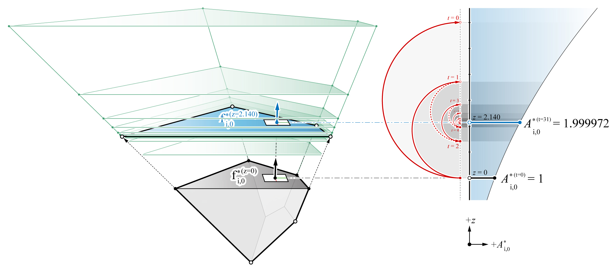
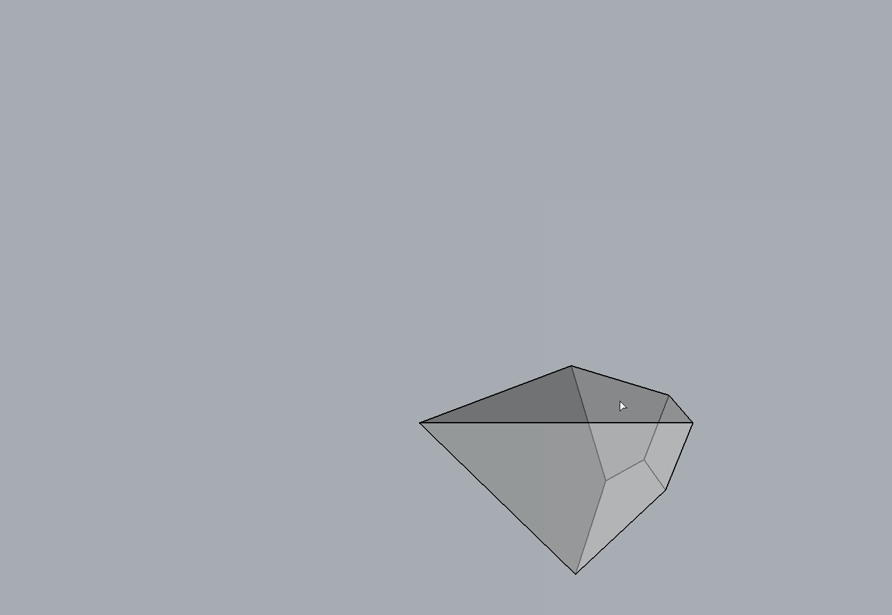

********************************************************************************
Arearisation
********************************************************************************

Face pull operation of a cell changes the distribution of the forces.
However, the precise amount of change in the area of the pulled face is not visually quantifiable, and it is not immediately apparent how the opeartion will affect the face's oriented normal.
Rather than pulling the faces in arbitrary amounts, finding the new face location such that the resulting face area matches a target value will enable a more force-controlled geometric operation.

A face's area can be formulated as a function of its :math:`z` position along its normal.
A simple iterative minimisation technique, such as the *Golden Section Search* ([1]_), can be used to compute the :math:`z` position at which the face area is equal to the target area.

|

Because arearisation algorithm allows a more precise control of the areas of individual faces of a cell, and therefore the magnitudes of the forces in the corresponding members in the form diagram, it can be used to explain the concept of static indeterminacy of spatial structures.
It can also demonstrate that polyhedral reciprocal diagrams are not limited to the exploration of statically determinate spatial structures, but also various possible equilibrium solutions for statically indeterminate structures
([2]_, [3]_ and [4]_).

In an indeterminate structure, the distribution of forces among the members of the structure is highly dependent on the boundary conditions, imperfections of the building components and the tolerance accumulated during the assembly on site.
Therefore, the actual internal stress state is unknown, difficult to predict and is sensitive to minor changes in the boundary conditions. Using polyhedral force diagrams and the arearisation algorithm, indeterminate states of equilibrium can be visualised and described.
In the context of structural design, this indeterminacy can be exploited to explore and obtain different internal equilibrium states.

|

.. figure:: ../../_images/cell_arearise_examples.jpg
    :width: 100%

----

Example
=======

|

.. raw:: html

    

    

    
Download

* :download:`cell_gss.3dm <../../../examples/rhino_files/cell_gss.3dm>`

.. raw:: html

    

    

.. literalinclude:: ../../../examples/00_20_cell_arearise_face.py
    :language: python

.. note::

    - If a negative target area is entered, the face must flip its normal direction as well as match the magnitude of the target area. It is possible that one or both of these two constraints can not be satisfied.
    - For a positive target area, two solutions exist. The solution with a :math:`z` value that is closer to the initial face position will be given.

----

References
==========

.. [1] Kiefer, J. (1953). Sequential minimax search for a maximum. In *Proceedings of the American Mathematical Society* 4(3), 502-506.

.. [2] Kilian, A. and J. Ochsendorf (2005). Particle-spring systems for structural form finding. *Journal of the International Association for Shell and Spatial Structures* 46(147), 77–84.

.. [3] Block, P. (2005). *Equilibrium systems: Studies in masonry structure*. Master’s thesis, Massachusetts Institute of Technology, Cambridge, MA, USA.

.. [4] Van Mele, T., L. Lachauer, M. Rippmann and P. Block (2012). Geometry-based understanding of structures. *Journal of the International Association for Shell and Spatial Structures* 53(174), 285–295.

