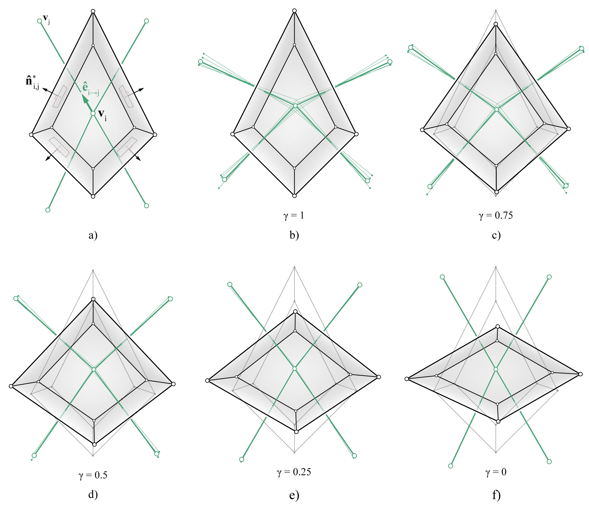

********************************************************************************
Reciprocation
********************************************************************************

In 3D graphic statics, every edge of the form diagram is perpendicular to the corresponding faces in the polyhedral force diagram.
This perpendicularity constraint is imposed through an iterative procedure, similar to the method implemented for graphic statics applications in 2.5D ([1]_) and 3D ([2]_).
The procedure is implemented as the "reciprocation" algorithm, which iteratively parallel-ises the edges of the form diagram towards the normal vectors of their corresponding faces in the polyhedral force diagram.
The procedure can also work in the reverse direction, where the edges of the form diagram remains fixed and the faces of the polyhedral force diagrams are iteratively re-oriented.

A weight factor of :math:`\gamma` between 0 and 1 can also be set, which determines how much each diagram is allowed to change.
If :math:`\gamma = 1`, the polyhedral force diagram will remain fixed, and only the edges of the form diagram will be re-oriented.
If :math:`\gamma = 0`, the form diagram will remain fixed, and only the faces of the polyhedral force diagram will be re-oriented.

For a detailed description of this procedure, please see [3]_.

____

Example
=======

.. literalinclude:: ../../../examples/01_11_volmesh_reciprocation.py
    :language: python

____

References
==========

.. [1] Rippmann, M., L. Lachauer, and P. Block (2012). Interactive vault design. *International Journal of Space Structures 27* (4), 219–230.

.. [2] Akbarzadeh M., Van Mele T. and Block P. On the equilibrium of funicular polyhedral frames and convex polyhedral force diagrams. *Computer-Aided Design 63*, 118–128.

.. [3] Lee J. (2018). *Computational Design Framework for 3D Graphic Statics*. PhD thesis, ETH Zurich, Zurich, Switzerland.