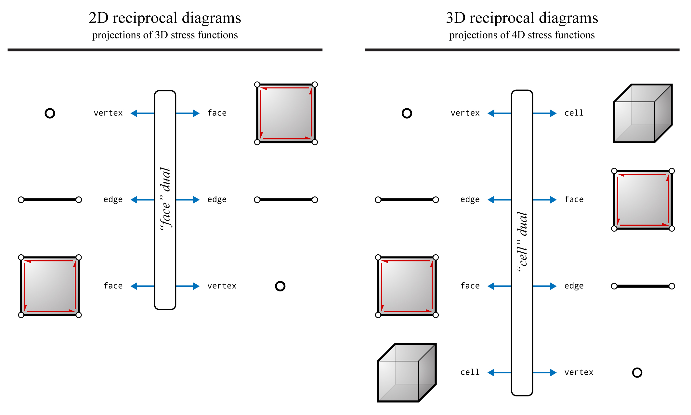
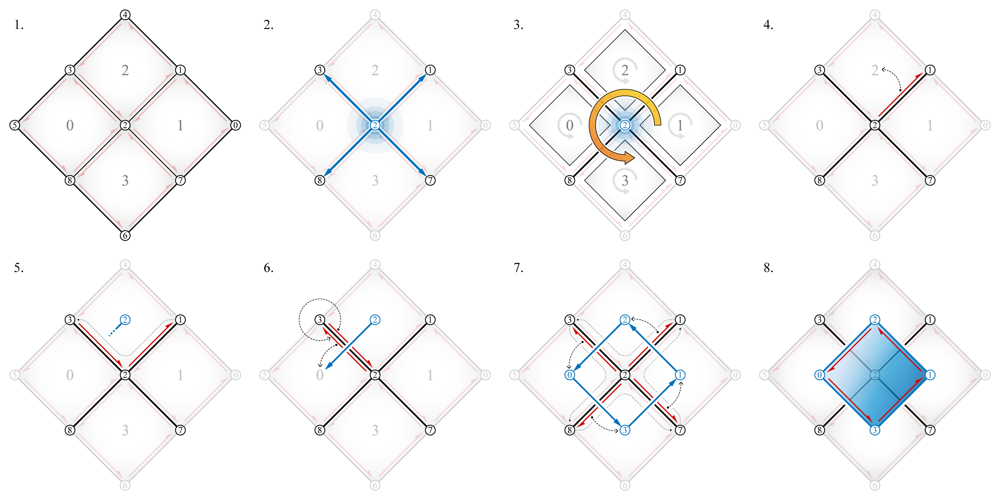
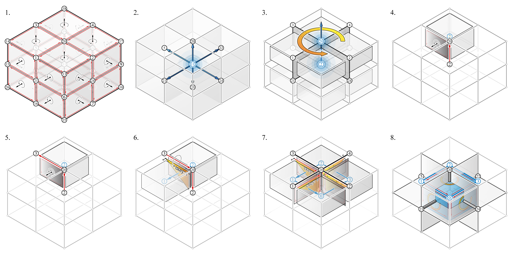

********************************************************************************
Duality
********************************************************************************

James Clerk Maxwell used the principle of duality in projective geometry to express the
reciprocal relationship between the form and force diagrams in the context
of graphic statics ([1]_).
The 2D form and force diagrams have a dual relationship with each other; the points and lines of one diagram is mapped to the lines and points of the other.
The mapping of one geometric object in one diagram to a different geometric object in the other diagram can be explained by Maxwell’s observation that 2D form and force diagrams are projections of plane-faced three-dimensional polyhedrons ([2]_, [3]_).

The same relationship is true for any :math:`n`-dimensional reciprocal form and
force diagrams: n-dimensional reciprocal diagrams are projections of :math:`(n+1)`-dimensional stress functions ([4]_, [5]_)
Based on this principle, three-dimensional form and force diagrams can be defined as projections of four-dimensional stress functions.
The duality relationships between the elements of :math:`n`-dimensional structures and the :math:`(n+1)`-dimension of the corresponding stress functions are summarised in the figure below.

    Summary of the duality relationships between the elements of :math:`n`-dimensional structures and the :math:`(n+1)`-dimension of the corresponding stress functions (force diagrams) (after Figure 1 of [6]_).

____

Face dual
=========

The reciprocal diagrams of 2D structures have a "face dual" relationship, where the vertices one diagram corresponds to the faces of the other diagram.
"Face dual" is equivalent to the `compas.datastructures.mesh_dual <https://compas-dev.github.io/main/api/generated/compas.datastructures.mesh_dual.html#compas.datastructures.mesh_dual>`_.
The steps of the "face_dual" constructor is graphically summarised below.

|

____

Cell dual
=========

The reciprocal diagrams of 3D structures have a "cell dual" relationship, where the vertices of one diagram corresponds to the cells of the other diagram.
A polyhedral cell and the corresponding form diagram have a cell dual relationship; the polyhedral cell and its faces correspond to a vertex and edges of the form diagram, respectively.
The "cell dual" constructor is implemented as :func:`compas_3gs.algorithms.volmesh_dual_volmesh`.
The steps of the "cell_dual" constructor is graphically summarised below.

|

____

From volmesh to volmesh
=======================

Using the "cell dual" relationship, a dual volmesh can be constructed from an existing volmesh.

.. figure:: ../../_images/02_20_duality_volmesh_volmesh_screenshot_2.jpg
    :width: 100%

.. raw:: html

    

    

    
Downloads

* :download:`cubes_4x4.3dm <../../../examples/rhino_files/cubes_4x4.3dm>`

.. raw:: html

    

    

.. literalinclude:: ../../../examples/01_20_volmesh_duality_volmesh.py
    :language: python

.. note::
    An input ``volmesh`` with a minimum of four cells is required for the construction of a dual ``volmesh`` (a tetrahedron). In another words, in order for a volmesh to have a dual volmesh, the volmesh needs to have an interior vertex.

____

From volmesh to network
=======================

If the initial volmesh is interpreted as a polyhedral force diagram, then the edges of the dual_volmesh then represents the polyhedral form diagram.
The topological information (vertices, edges, faces and cells) of the dual_volmesh is intrinsically embedded in the volmesh.
From a practical point of view, the edges of the form diagram are typically of interest to the designer.
Therefore, not all information need to be constantly duplicated during the design process.
The corresponding form diagram of a polyhedral force diagram modelled as a volmesh, can equivalently be represented by a network.
When needed, additional topological information about the network can be retrieved from the volmesh.
For example, the face and cell information of the network can be computed from the topological information of the corresponding interior vertex of the volmesh.

|

.. figure:: ../../_images/02_20_duality_volmesh_network_screenshot.jpg
    :width: 100%

.. raw:: html

    

    

    
Downloads

* :download:`cubes_4x4.3dm <../../../examples/rhino_files/cubes_4x4.3dm>`

.. raw:: html

    

    

.. literalinclude:: ../../../examples/01_21_volmesh_duality_network.py
    :language: python

____

References
==========

.. [1] Harman, P. M. (2001). *The Natural Philosophy of James Clerk Maxwell*. Cambridge University Press.

.. [2] Maxwell, J. C. (1864). On reciprocal figures and diagrams of forces. *Philosophical Magazine Series 4* 27(182), 250–261.

.. [3] Maxwell, J. C. (1870). On reciprocal figures, frames and diagrams of forces. *Transactions of the Royal Society of Edinburgh* 26(1), 1–40.

.. [4] Crapo, H. andW. Whiteley (1994). Spaces of stresses, projections and parallel drawings for spherical polyhedra. *Beiträge zur Algebra und Geometrie* 35(2), 259–281.

.. [5] Konstantatou, M. and A. McRobie (2016). Reciprocal constructions using conic sections poncelet duality. In *Proceedings of the 2016 International Association for Shell and Spatial Structures (IASS) Symposium*, Tokyo, Japan.

.. [6] Konstantatou, M. and A. Mcrobie (2018). Graphic statics for optimal trusses geometry-based structural optimisation. In *Proceedings of the 2018 International Association for Shell and Spatial Structures (IASS) Symposium*, Boston, USA.