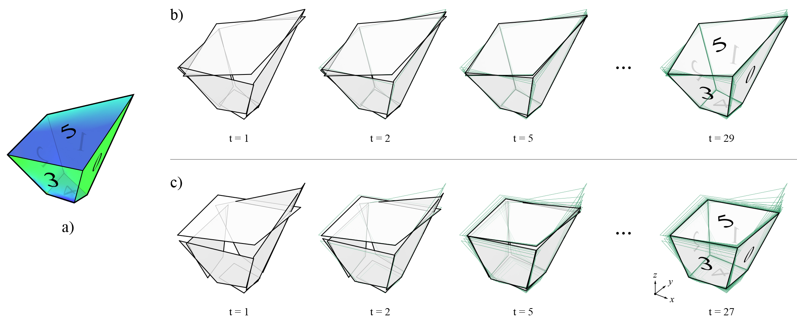

********************************************************************************
Planarisation
********************************************************************************

At any point during the design process, the faces of polyhedral cells or multi-cell polyhedrons may become non-planar.
Before any further design explorations can be made, the non-planar faces need to be planarised.
Planarisation of non-planar faces can be formulated as an iterative projection method, which is a tried-and-tested methodology in computational geometry ([1]_, [2]_ and [3]_).

Figure 1 shows an example application of the planarisation algorithm, implemented using the iterative projection method.
At each time step, each face is projected onto either: the plane defined by its initial normal and the current centroid; a plane defined by a target normal; or a best-fit plane computed from its current vertex coordinates.
Because faces are projected independently from one another, there will be multiple coordinates for a single vertex at the end of each time step.
The average or the barycenter of the coordinates of a vertex is its new location for that time step.
The procedure continues until a desired tolerance has been reached.

If there are no constraints enforced, each face projects itself to the plane
defined by its current centroid and normal (Figure 1-b).
In some 3D graphic statics applications, specified faces may need to stay fixed in their orientations.
For example, some of the boundary faces of a multicell polyhedron corresponds to externally applied loads, which typically do not change in their magnitudes or locations during the design process.
In addition, it may sometimes be desired to fix the orientations of certain members in the form diagram.

The orientation constraint can be enforced by updating the ``fix_normal`` attribute of the specified faces.
Individual vertex constraints can also be set by updating the ``x_fix``, ``y_fix``, ``z_fix`` attributes for the specified vertices.
Figure 1-c shows the planarisation, but this time with faces 2, 1 and 5 constrained to be perpendicular to the x, y and z axes, respectively.

    **Figure 1.** Planarisation of a polyhedral cell with non-planar faces: a) unconstrained planarisation, where the best-fit planes is used for each face at every iteration; and b) constrained planarisation, where some of the faces are given target normal vectors (faces 2, 1 and 5 are constrained to be perpendicular the x, y and z axes, respectively).

----

Example
=======

In this example, three random vertices are chosen to remain fixed during the planarisation.

.. image:: ../../_images/volmesh_planarisation_gif.gif
    :width: 100%

|

.. raw:: html

    

    

    
Downloads

* :download:`volmesh_warped.3dm <../../../examples/rhino_files/volmesh_warped.3dm>`

.. raw:: html

    

    

.. literalinclude:: ../../../examples/01_40_volmesh_planarisation.py
    :language: python

|

----

References
==========

.. [1] Liu, Y., H. Pottmann, J. Wallner, Y.-L. Yang, and W. Wang (2006, July). Geometric modeling with conical meshes and developable surfaces. **ACM Trans. Graph.** 25(3), 681–689.

.. [2] Bouaziz, S., M. Deuss, Y. Schwartzburg, T. Weise, and M. Pauly (2012). Shape-up: Shaping discrete geometry with projections. **Comput. Graph. Forum** 31(5), 1657–1667.

.. [3] Deuss, M., A. H. Deleuran, S. Bouaziz, B. Deng, D. Piker, and M. Pauly (2015). Shapeop—a robust and extensible geometric modelling paradigm. In R. M. Thomsen, M. Tamke, C. Gengnagel, B. Faircloth, and F. Scheurer (Eds.), **Modelling Behaviour: Design Modelling Symposium 2015** , pp. 505–515. Cham: Springer International Publishing.