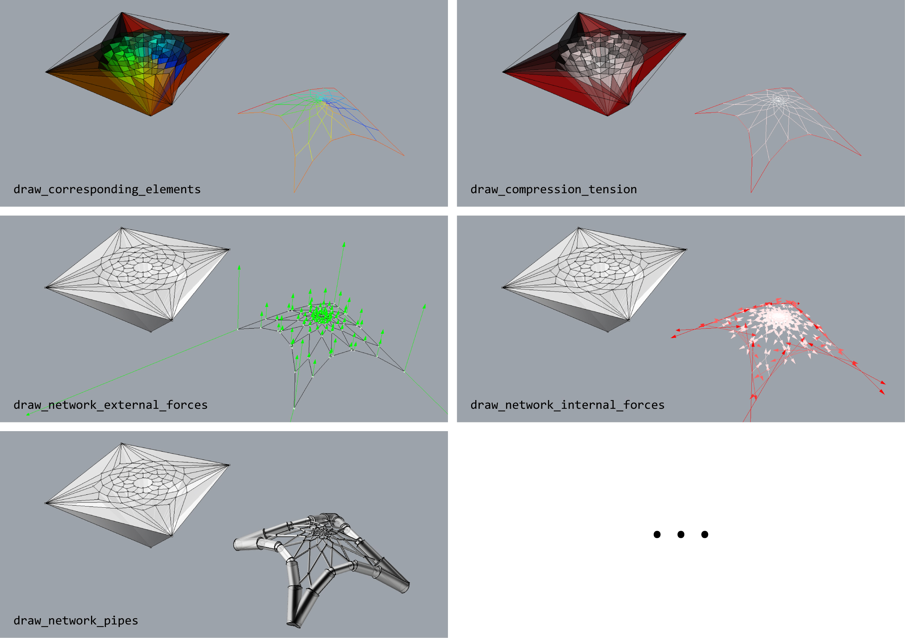

********************************************************************************
Visualisation
********************************************************************************

Different visualisation modes may be necessary depending on the design
problem at hand.
By default, the faces of the force diagrams are displayed as a set of meshes, and the corresponding form diagram is displayed using points and lines.
If the global force distribution needs to be assessed, the magnitudes of the forces in the structure can be displayed through pipes with different sizes, as scaled force vectors at each of the nodes, or by simply using a consistent colour scale on both form and force diagrams.

|

----

Example
=======

|

.. raw:: html

    

    

    
Downloads

* :download:`volmesh_shells.3dm <../../../examples/rhino_files/volmesh_shells.3dm>`

.. raw:: html

    

    

.. literalinclude:: ../../../examples/01_70_volmesh_visualisation.py
    :language: python