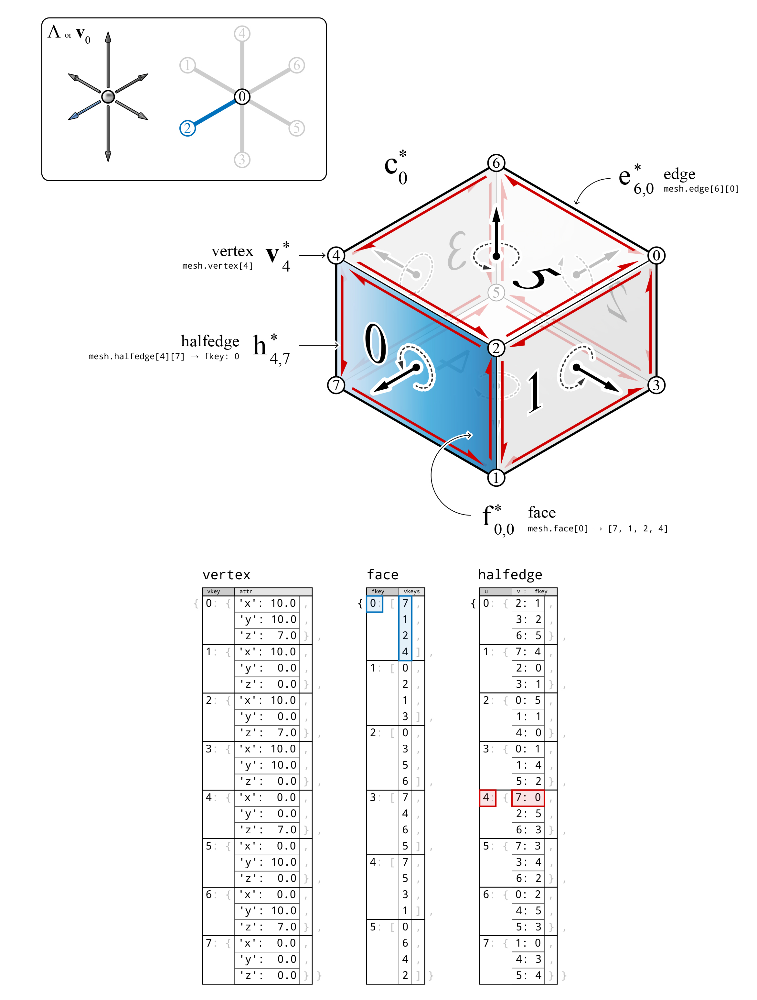

********************************************************************************
Datastructure
********************************************************************************

A polyhedral cell which is typically used for the representation of a global
force polyhedron :math:`\Lambda^{\perp}`, is modelled as a ``mesh``.
The initial form diagram :math:`\Lambda`, which contains the information of the magnitudes and locations of the external forces, are typically a disconnected set of vectors or "lines" in space.
These vectors can be moved to one location such that the heads of the
vectors are coincident.
The consolidated vectors then can be modelled as a ``network``, where each external force is represented with an edge.

.. figure:: ../../_images/04_datastructures_01_cell.jpg
    :width: 100%

|

----

|

