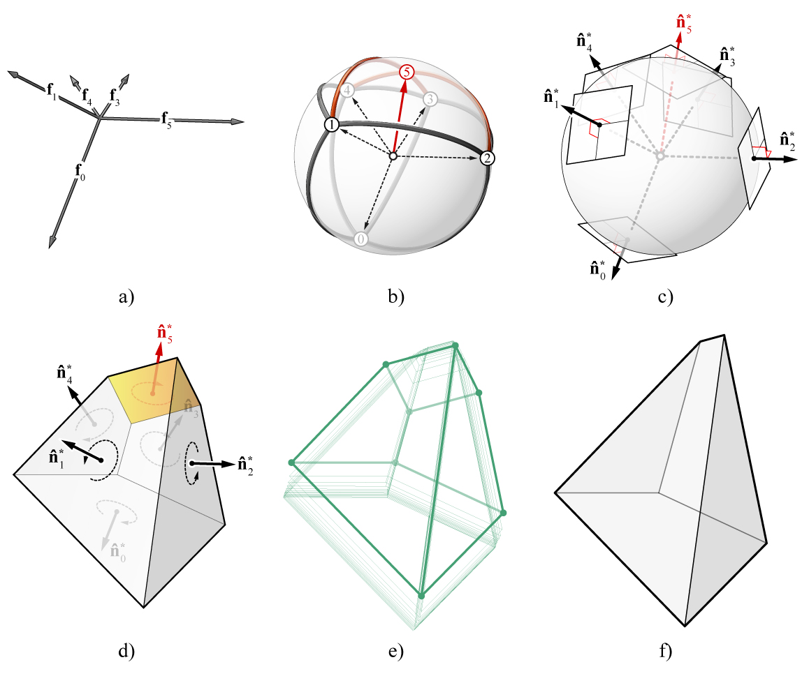

********************************************************************************
Extended Gaussian Image
********************************************************************************

Background
==========

what is egi...

why it is ineeded...

    Construction sequence of a polyhedral cell using the EGI: a) equilibrated force vectors; b) the EGI with adjacency and cross-adjacency arcs; c) normal vectors at each of the point masses on the Gaussian sphere; d) unit polyhedral cell; e) iterative resizing of the faces towards their target areas to computer the final geometry of the polyhedral sell; and f) final geometry of the polyhedral cell.

Examples
========

.. image:: ../../_images/04_egi_examples_animations.gif
    :width: 100%

References
==========

