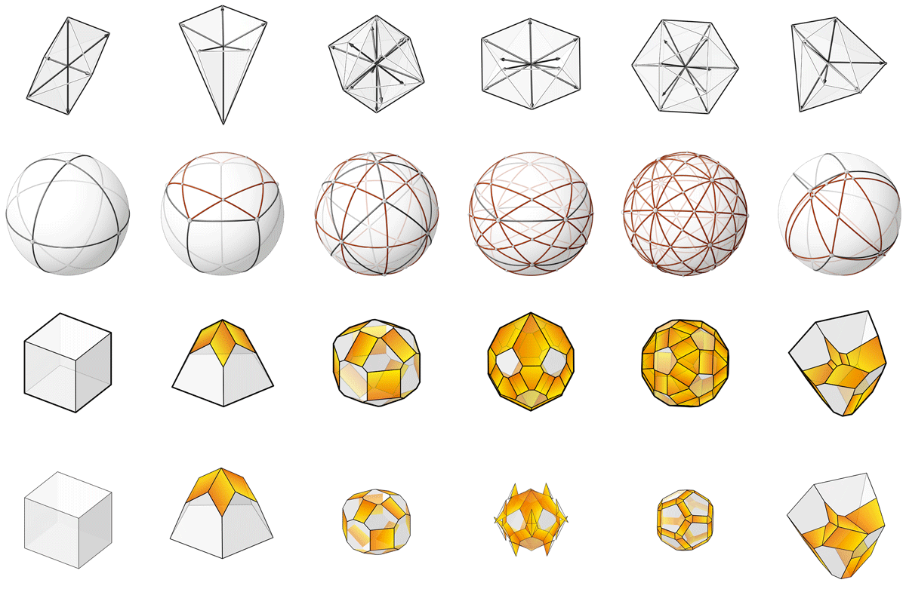

********************************************************************************
Example: constructor
********************************************************************************

Background
==========

Computation of polyhedral geometry, or more commonly known as polyhedral reconstruction in the literature, is a well-researched topic for a variety of applications in many disciplines, such as computer vision, computational geometry and combinatorics.
In most applications, the objective is to reconstruct the polyhedral geometry
from partial information about the polyhedra (i.e. from projected images, vertex locations, edge lengths, face geometries, face normals, face areas, dihedral angles, etc.) ([1]_).
The polyhedral reconstruction method that is most relevant to 3D graphic statics is the one based on face normals and areas.

The theory of polyhedral reconstruction from its face normals and areas, or modifying the polyhedral geometry with target face areas, originate from Minkowski’s theorem ([2]_).
The iterative polyhedral reconstruction method of ``compas_3gs`` uses the Extended Gaussian Image ([3]_) of polyhedral cells, and builds on the initial implementations by Little ([4]_) and Moni ([5]_).
For a detailed theoretical background and a technical overview of the implementation, please refer to [6]_.

By modifying the target normal vectors and face areas, this method can be used to construct global force polyhedrons that address various site condition constraints. For more examples, please refer to [6]_ and [7]_.

The procedure is graphically summarised below.

.. figure:: ../../_images/04_egi_cell_constructor_wide_labeled.jpg
    :width: 100%

|

____

Example
=======

.. literalinclude:: ../../../examples/01_egi_cell_construction.py
    :language: python

|

|

.. note::

    As implemented, the method is optimised for convex polyhedral cells, and may not converge to stable solutions when there are multiple parallel force vectors present.

----

References
==========

.. [1] Demaine, E. D. and J. O’Rourke (2007). *Geometric Folding Algorithms: Linkages, Origami, Polyhedra*, Chapter 23, pp. 339–357. Cambridge University Press.

.. [2] Alexandrov, A. (2005). *Convex Polyhedra* (1st ed.). Springer Monographs in Mathematics. Springer-Verlag Berlin Heidelberg.

.. [3] Horn, B. K. P. (1984). Extended Gaussian images. In *Proceedings of the IEEE* 72(2), 1671–1686.

.. [4] Little, J. J. (1983). An iterative method for reconstructing convex polyhedra from external guassian images. In *Proceedings of the 1983 Association for the Advancement of Artificial Intelligence (AAAI)*, pp. 247–250.

.. [5] Moni, S. (1990). A closed-form solution for the reconstruction of a convex polyhedron from its extended gaussian image. In *Proceedings of the 10th International Conference on Pattern Recognition*, Volume 1, pp. 223–226.

.. [6] Lee, J., T. Van Mele, and P. Block (2018). Disjointed force polyhedra. *Computer-Aided Design 99*, 11 – 28.

.. [7] Lee J. (2018). *Computational Design Framework for 3D Graphic Statics*. PhD thesis, ETH Zurich, Zurich, Switzerland.