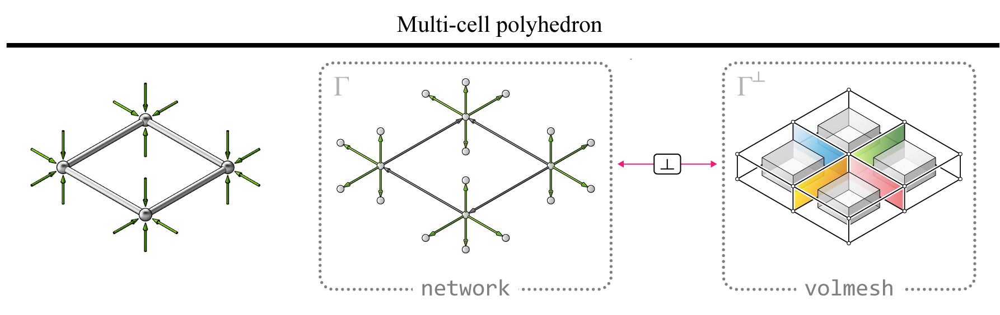
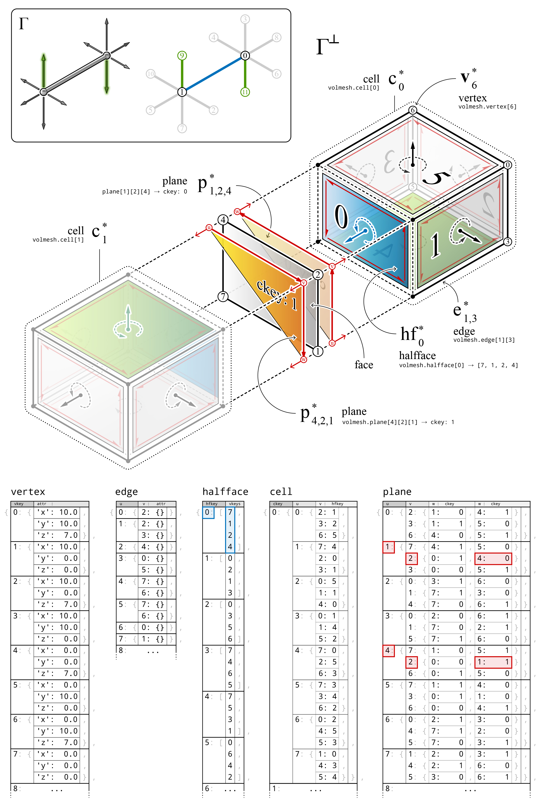

********************************************************************************
Datastructure
********************************************************************************

A multi-cell polyhedron :math:`\Gamma^{\perp}` and its corresponding polyhedral form diagram :math:`\Gamma` are modelled as ``volmesh`` and ``network``, respectively.
Because :math:`\Gamma^{\perp}` and :math:`\Gamma` are topologically dual to each other, :math:`\Gamma` can also be modelled as a ``volmesh``.
However, because the topological information of :math:`\Gamma` is embedded in :math:`\Gamma^{\perp}`, some information do not need to be duplicated.
For example, the face and cell information of :math:`\Gamma` can be computed from the topology of :math:`\Gamma^{\perp}`.
The polyhedral form diagram :math:`\Gamma` as a ``network`` is essentially a visualisation of the cell connectivity information of :math:`\Gamma^{\perp}`, where each edge of :math:`\Gamma` is perpendicular to its corresponding face of :math:`\Gamma^{\perp}`.

|

----

|

