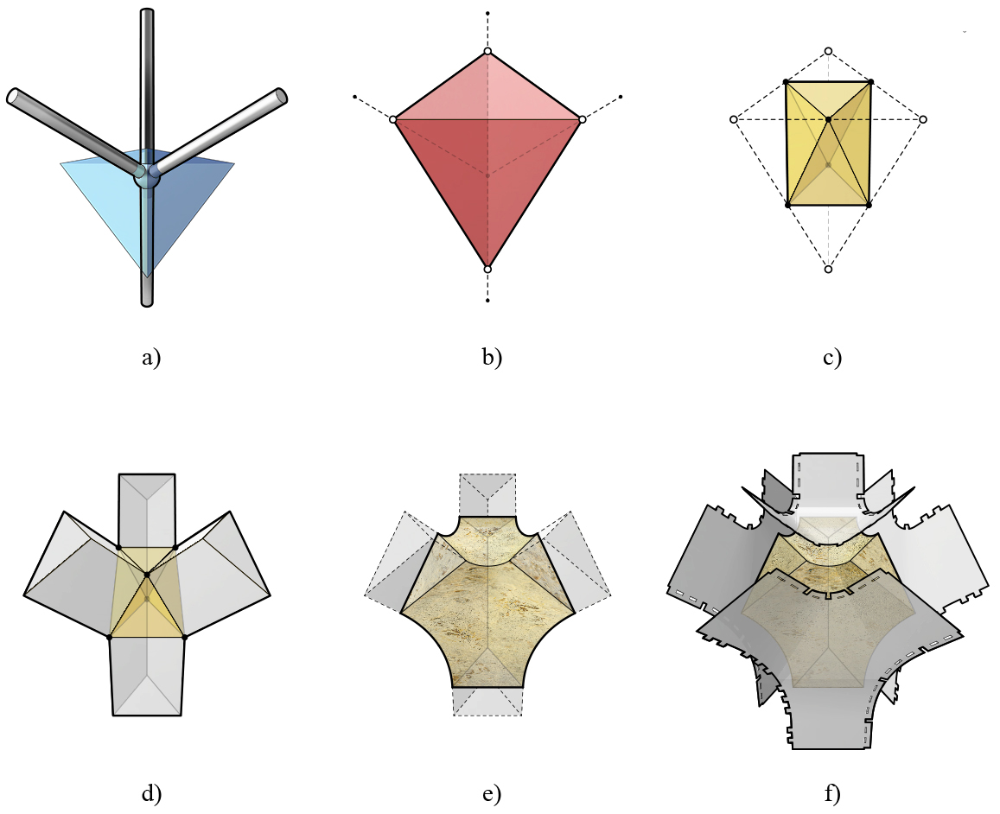

********************************************************************************
Example
********************************************************************************

MycoTree node example...

how polyhedral cells can be used to develop mould geometry using planar sheet material

